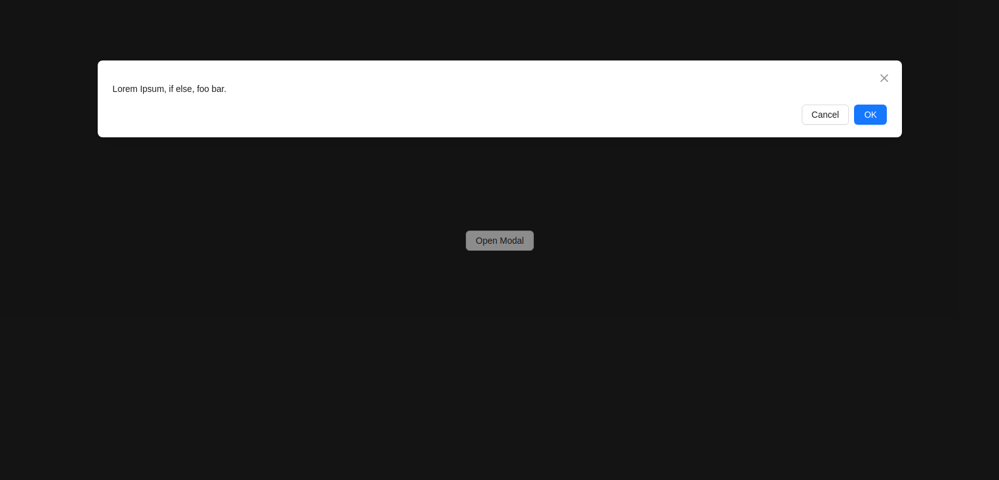

# This project intends to learn how to create a custom Component using UI Libraries

## Principals Concepts

> Spread Objects
> Imports / Exports

## Introducing 

In this example, we have a simple page thats open a modal when it click a button. This Modal has a width of 80% of the screen. 

```ts

import { useState } from 'react'
import { Button, Modal } from 'antd'
import './App.css'
function App() {
  const [open, setOpen] = useState(false)

  return (
    <div className='card'>
      <Button
        onClick={() => setOpen(true)}
      >
        Open Modal
      </Button>
      <Modal
        open={open}
        onCancel={() => setOpen(false)}
        width={'80%'}
      >
        <div>
          <p>Lorem Ipsum, if else, foo bar.</p>
        </div>
      </Modal>
    </div>
  )
}

export default App
```

In the desktop screen: 



However, in the mobile view, i prefer that the modal width has 100% of the screen, but I got 80% too, how  to fix it ? Using spread props
In this project, I teach how do this. 

For to use this project. get `git clone` in this project and execute the `npm install` command to install the dependencies
Run `npm run dev` to run the project 


